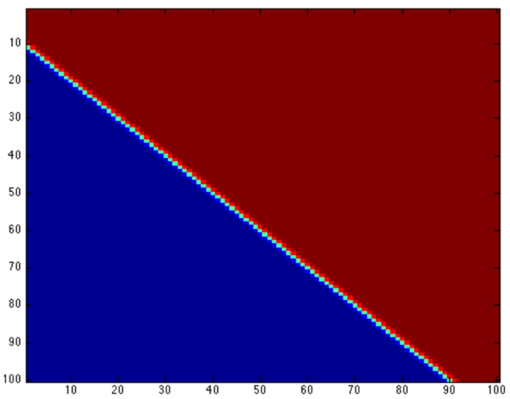

# Formal neuron

## Definition

Formal neurons are binary classifiers. They separate a space by a hyperplane. So they can only solve linear classification issues.

## Unitary tests

### Heaviside function

To test the heaviside function as the activation function of a formal neuron, we use these parameters : **[w1, w2] = [1, -1]** and **w0=10**. Moreover we will put the **a** parameter to **1000**. So we have two cases :
* x1 - x2 + 10 >= 0 => 1.0
* x1 - x2 + 10 < 0 => 0.0

### Sigmoid function

To test the sigmoid function as the activation function of a formal neuron, we use these parameters : **[w1, w2] = [1, -1]** and **w0=10**. Moreover we will put the **a** parameter to **1000**. So we have three cases :
* x1 - x2 + 10 > 0 => y = 1.0
* x1 - x2 + 10 = 0 => y = 0.5
* x1 - x2 + 10 < 0 => y = 0.0

We can see those both results in the following chart :

*Note :* *In blue we have the formal neuron output equals to 0 and in red to 1.*